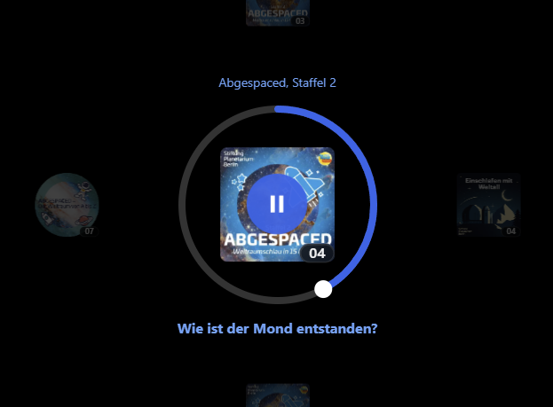

# XMB Audiobook Player

> [!NOTE]
> The project name is a placeholder. Please [submit](https://github.com/hheimbuerger/xmbaudiobookplayer/issues) your suggestions! 🤩

This player provides an intuitive interface for navigating and playing audiobook episodes or podcasts. The interface provides a unique visual experience with smooth animations, inspired by classic console UIs (in particular, the PlayStation 3's [XrossMediaBar](https://en.wikipedia.org/wiki/XrossMediaBar)). It is designed for touch screens first, but does support using the mouse to emulate finger swipes.

It uses a grid-based navigation system where shows are arranged side-by-side horizontally and episodes are stacked vertically. The episode in the center is the active episode, which can be played back inline. The grid can we swiped around to move another series or episode into the active center.

<!--  -->

<!--  -->


## Features

- **XMB-style navigation** - Grid-based interface with smooth momentum scrolling
- **Touch-first design** - Optimized for touch screens, mouse support included
- **Multiple backends** - Audiobookshelf, Archive.org, or sample data
- **Progress sync** - Playback position remembered across sessions
- **Inline playback** - Play episodes directly in the interface

## Quick Start

1. **Download** a release from GitHub
2. **Extract** to your web server directory
3. **Create `config.js`** from the [config.example.js](config.example.js) file.
4. **Configure** your Audiobookshelf server:
   ```javascript
   export const config = {
     repository: {
       type: 'audiobookshelf',
       config: {
         url: 'https://your-audiobookshelf-server.com',
         apiKey: 'your-api-key-here',
         libraryId: 'your-library-id-here',
       },
     },
   };
   ```
5. **Serve** the directory with any static web server

**Finding your Audiobookshelf credentials:**
- **URL**: Your Audiobookshelf server address
- **API Key**: Settings → Users → API Tokens
- **Library ID**: Found in the URL when viewing a library

**Alternative backends:**
- **Archive.org**: Use public domain LibriVox audiobooks (see `config.example.js`)
- **Sample data**: Built-in test data for trying out the interface

For detailed deployment instructions, development setup, and component integration, see [specs/deployment.md](specs/deployment.md).

## License

MIT

## Credits

Devised by @hheimbuerger. Made unique by @cspaeth's idea of inlining the player.  
Implemented by Claude 4.5 Sonnet.
